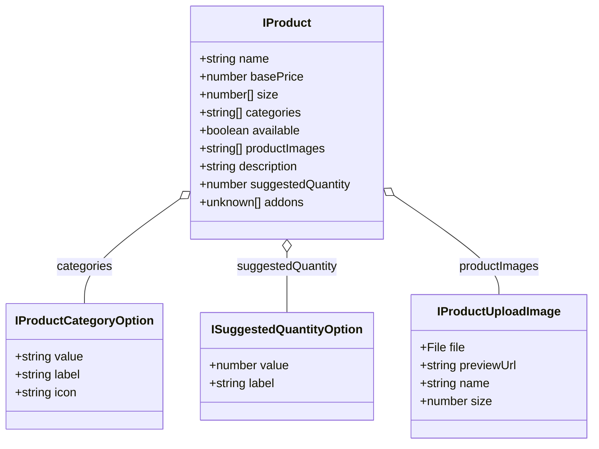

# Add Product Feature - Operational & Architectural Guide

This document provides a comprehensive operational and architectural guide for the **Add Product (`addProduct`)** feature implemented in **Il Rusticone Frontend (`rusticone-fe`)**.

---

## 🍕 1. Feature Overview & Purpose

The **Add Product** module allows administrators to create and configure new catalog items for "Il Rusticone". Products created here feed directly into:
1. **The Admin Menu Catalog**: Visible and editable by restaurant staff.
2. **The Customer Menu & Buffet Builder**: Used by customers to customize catering orders.
3. **The AI Assistant / Chatbot**: Used by the AI assistant to recommend catering quantities and estimate guest needs.

---

## 📐 2. Architecture & File Structure

The feature resides in the `admin-menu` feature module and is composed of the following standalone artifacts:

```
src/app/
├── core/
│   └── models/
│       └── product.model.ts                   # Interfaces (IProduct, IProductCategoryOption, etc.)
└── features/
    └── admin/
        └── admin-menu/
            └── add-product/
                ├── add-product.ts             # Standalone component logic with Signals & Reactive Form
                ├── add-product.html           # Accessible HTML template with semantic test IDs
                ├── add-product.css            # Tailwind v4 / DaisyUI scoped styles & animations
                └── add-product.spec.ts        # Vitest suite (Layout & Behavior specifications)
```

---

## 🗄️ 3. Data Model & Backend Schema Mapping

The frontend `IProduct` interface strictly mirrors the backend Mongoose `productSchema`:



### Schema Field Specifications

| Field | Type | Validation & Constraints | Business Logic |
| :--- | :--- | :--- | :--- |
| `name` | `string` | Required, min 5 chars, non-whitespace | The public title of the product (e.g., "Pizza Margherita DOC"). |
| `basePrice` | `number` | Required, min `0.00` | Base selling price in Euros (€). |
| `size` | `number[]` | Required, at least 1 item, values $\ge 1$ | Available portion/cut sizes (e.g. `[1]` for single, `[1, 6, 12, 24]` for baking pans). |
| `categories` | `string[]` | Required (mapped to category enum) | Product classification (Pizze, Rustici, Fritti, Dolci, Bevande). |
| `available` | `boolean` | Boolean flag (default: `true`) | Controls live visibility on the customer menu and quote builder. |
| `productImages` | `string[]` | Array of image URLs / storage paths | Product photography uploaded via the dropzone. |
| `description` | `string` | Optional text | Ingredients, origin, allergens, and preparation details. |
| `suggestedQuantity` | `number` | Required, min `1` | Pieces recommended per person for quote calculations. |
| `addons` | `unknown[]` | Free-text string or string array | Customizations (e.g. "Senza glutine", "Mozzarella extra"). |

---

## 🖥️ 4. Layout & UI Architecture

The page layout is engineered for both desktop and mobile viewports with a split-scrolling strategy:

```
+-------------------------------------------------------------------+
|  [<-]  Nuovo prodotto —                          (o) Disponibile  |  <- FIXED HEADER
+-------------------------------------------------------------------+
|                                                                   |
|   + - - - - - - - - - - - - - - - - - - - - - - - - - - - - - +   |
|   |                   [Photo Icon]                            |   |
|   |               Carica foto prodotto                        |   |  <- IMAGE DROPZONE
|   |                PNG, JPG fino a 5MB                        |   |     (Drag & Drop)
|   + - - - - - - - - - - - - - - - - - - - - - - - - - - - - - +   |
|   | [Img 1] [Img 2] ...                [Carica immagini] (btn)|   |  <- DYNAMIC UPLOAD BAR
|                                                                   |
|   Nome prodotto *                                                 |
|   [ es. Margherita                                          ]     |
|                                                                   |
|   Categoria *                        Prezzo (€) *                 |
|   [ 🍕 Pizze               v ]       [ € 0.00               ]     |
|                                                                   |  <- SCROLLABLE FORM
|   Porzioni / Taglie disponibili (pz o persone) *                  |     (flex-1 overflow-y-auto)
|   Preset: [1 (Singola)] [6 (Media)] [12 (Teglia)] [24 (Maxi)]     |
|   Active: [ 1 pezzo (x) ] [ 6 pezzi (x) ]                         |
|   [ es. 8     ] [+ Aggiungi formato]                              |
|                                                                   |
|   Quantità consigliata per persona *   Opzioni & Aggiunte         |
|   [ 2 pz / persona         v ]       [ es. Senza glutine    ]     |
|                                                                   |
|   Descrizione                                                     |
|   [ Ingredienti principali, preparazione, origine...        ]     |
|                                                                   |
+-------------------------------------------------------------------+
|  [                     ✓ Aggiungi al listino                   ]  |  <- FIXED FOOTER
+-------------------------------------------------------------------+
```

### Key UI Features:
1. **Fixed Header**: Stays pinned at the top. Contains the back button (`routerLink` to `/dashboard/admin/menu`) and the `Disponibile` / `Non disponibile` interactive toggle pill.
2. **Scrollable Form Container**: Houses all form controls in a centralized, responsive grid with full vertical scroll support on small screens (`overflow-y-auto`).
3. **Fixed Footer**: Pinned at the bottom with the `"✓ Aggiungi al listino"` button, ensuring the primary CTA is always visible without scrolling to the bottom.

---

## ⚙️ 5. Detailed Sub-Feature Logics

### 5.1 Image Dropzone & Dynamic Upload Action
- **Drag & Drop / File Browser**: Supports selecting or dragging image files (`image/png`, `image/jpeg`, `image/webp`).
- **Object URL Staging**: Generates lightweight preview thumbnails via `URL.createObjectURL(file)`.
- **Memory Safety**: Revokes object URLs via `URL.revokeObjectURL(url)` when images are deleted from the staged list to prevent browser memory leaks.
- **Dynamic Action Button**: The **"Carica immagini"** (`heroArrowUpTray`) button remains hidden until 1 or more images are staged. When clicked, it simulates/triggers the backend storage upload and tracks loading state.

### 5.2 Size / Portion Multiples Manager (`size`)
- **Use Case**: Differentiates between single-serving items (e.g. 1 panzerotto) and multi-portion items (e.g. a baking pan that can be ordered in 6, 12, or 24 slices).
- **Preset Buttons**: Quick 1-click toggles for common catering portions (`1`, `6`, `12`, `24`).
- **Custom Input**: Administrators can enter any custom integer $\ge 1$ and press Enter or click `+ Aggiungi formato`.
- **Constraint Enforcement**: Prevents removing the last active size (a product must always have at least 1 valid size).

### 5.3 Suggested Quantity per Person (`suggestedQuantity`)
- **Use Case**: Catering quotes calculate total quantities by multiplying the guest count by the suggested pieces per person.
- **Dropdown Mapping**: Populated via `suggestedQuantities` Signal from `DEFAULT_SUGGESTED_QUANTITIES` (e.g. `1 pz / persona`, `2 pz / persona`, etc.).

### 5.4 Addons & Customizations (`addons`)
- **Use Case**: Allows admin to specify available options, dough choices, and dietary variations.
- **Processing**: Accepts free text and splits comma-separated entries into clean string arrays upon form submission.

### 5.5 Form Validation & Submission
- Handled through `FormValidationService` to display contextual Italian error messages:
  - `name`: Min 5 characters, non-empty.
  - `category`: Must be selected.
  - `basePrice`: Must be $\ge 0$.
  - `suggestedQuantity`: Must be $\ge 1$.
- Upon submission:
  1. Marks all invalid controls as touched if validation fails.
  2. Formulates the complete `IProduct` payload.
  3. Navigates back to `APP_PATHS.DASHBOARD.ADMIN_MENU`.

---

## 🧪 6. Testing Strategy

The test suite in `add-product.spec.ts` adheres to project test conventions:
- **Test ID Prefix**: `const testIdPrefix = 'Add Product - ';`
- **Helper**: Uses `getByTestId(template, ..., { prefix: testIdPrefix })`.
- **Layout Tests**: Verifies header, back button navigation href, availability toggle, dropzone text, input presence, and fixed footer.
- **Behavior Tests**:
  - Initial form default states.
  - Availability toggle signal state & DOM reflection.
  - Size management (preset toggle, custom size addition, removal).
  - Validation triggers on invalid inputs.
  - Image staging, preview generation, and upload action visibility.
  - Complete form submission and navigation.

To execute the test suite:
```bash
npm test -- --watch=false
```
