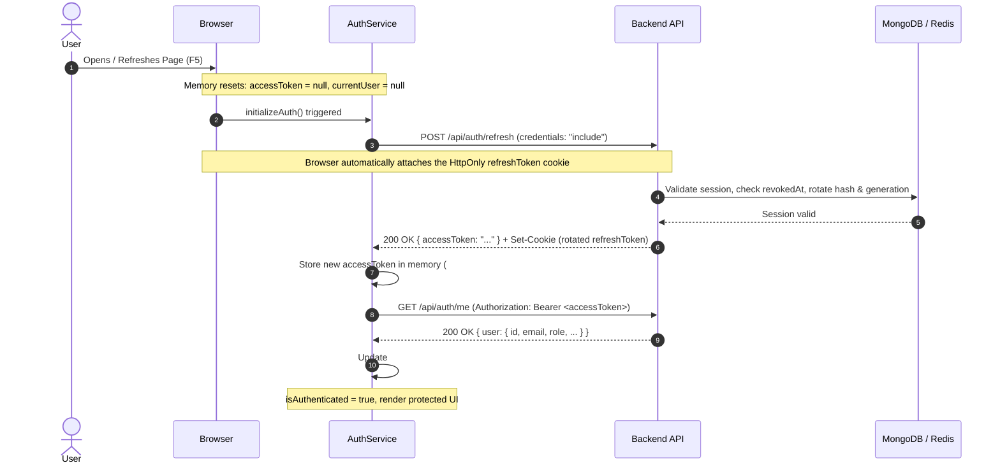

# Authentication & Session Architecture

This document explains the authentication, session lifecycle, and persistence model implemented in **Il Rusticone Frontend (`rusticone-fe`)**.

---

## 🔐 Architecture Overview

The application utilizes a **hybrid security model**:
- **Short-lived JWT Access Tokens**: Held **in memory only** (in Angular Signals). Never stored in `localStorage` or `sessionStorage`.
- **Rotating Refresh Tokens**: Transmitted and stored exclusively as **`HttpOnly` cookies** managed by the browser.

| Credential | Storage Location | Accessible by JavaScript? | Survives Page Refresh? | Lifetime |
| :--- | :--- | :--- | :--- | :--- |
| **Access Token** | Memory (`#accessToken` Signal in `AuthService`) | **Yes** (in memory only) | **No** (wiped on reload) | Short-lived (e.g. 15 min) |
| **Refresh Token** | Secure `HttpOnly` Cookie (`refreshToken`) | **No** (immune to XSS theft) | **Yes** (persists in browser) | Long-lived (e.g. 7 days) |

---

## 🔄 Session Persistence on Page Reload (F5 / Refresh)

Since access tokens are stored in JavaScript memory and wiped whenever the page reloads, session persistence is handled via a **silent refresh bootstrap** on application initialization.



### Step-by-Step Flow:

1. **Bootstrap Initialization (`initializeAuth`)**:
   During application startup (e.g., in `App.ngOnInit`), `AuthService.initializeAuth()` is invoked.
2. **Silent Refresh Request (`POST /api/auth/refresh`)**:
   The frontend calls `/api/auth/refresh` with `{ withCredentials: true }`. Even though JavaScript cannot access the `HttpOnly` cookie, the browser automatically attaches it to the request.
3. **Session Verification & Rotation**:
   The backend verifies the refresh token hash against MongoDB/Redis, rotates the refresh token generation, sets a new `HttpOnly` cookie, and returns a new JSON access token.
4. **User Profile Fetch (`GET /api/auth/me`)**:
   With the refreshed in-memory access token, the app requests the authenticated user's profile (`GET /api/auth/me` with `Authorization: Bearer <accessToken>`).
5. **Authenticated State Restored**:
   `currentUser` is populated, `isAuthenticated()` computed signal turns `true`, and the user stays logged in seamlessly.
6. **Graceful Fallback**:
   If the refresh token is missing, expired, or revoked (returns `401 Unauthorized`), the service resets to anonymous state (`accessToken = null`, `currentUser = null`) and the user can be redirected to `/login`.

---

## 🛡️ Security & Concurrency Design

### 1. XSS Defense (Cross-Site Scripting)
- Traditional `localStorage` token storage leaves tokens vulnerable to any malicious JavaScript executed via XSS.
- Storing access tokens **only in memory** and refresh tokens in **`HttpOnly` cookies** prevents scripts from extracting long-lived credentials.

### 2. Refresh Promise Coalescing (Race Condition Prevention)
- If multiple simultaneous HTTP requests encounter expired access tokens or trigger refresh at the same time, concurrent refresh calls could cause token reuse detection on the backend (revoking the entire session).
- `AuthService` coalesces concurrent refresh calls into a single shared promise (`#refreshPromise`), ensuring that only **one** refresh request is sent over the wire at a time.

```typescript
// Shared promise ensures only one refresh request runs concurrently
#refreshPromise: Promise<boolean> | null = null;

refreshAccess(): Promise<boolean> {
  if (this.#refreshPromise) {
    return this.#refreshPromise;
  }

  this.#refreshPromise = firstValueFrom(
    this.#http.post<IRefreshTokenResponse>(
      `${environment.apiUrl}${API_ENDPOINTS.AUTH.REFRESH}`,
      {},
      this.#httpOptions,
    ),
  )
    .then((response) => {
      if (response?.accessToken) {
        this.#accessToken.set(response.accessToken);
        return true;
      }
      this.setAnonymous();
      return false;
    })
    .catch(() => {
      this.setAnonymous();
      return false;
    })
    .finally(() => {
      this.#refreshPromise = null;
    });

  return this.#refreshPromise;
}
```

### 3. Centralized HTTP Options
All requests needing credential transmission (such as cookies) include `{ withCredentials: true }` via `#httpOptions`.

---

## 📡 API Endpoints Reference

| Endpoint | Method | Credentials / Headers | Payload / Response |
| :--- | :--- | :--- | :--- |
| `/api/auth/login` | `POST` | `withCredentials: true` | Body: `{ email, password }`<br>Response: `200 { accessToken, user }` + Cookie |
| `/api/auth/register` | `POST` | `withCredentials: true` | Body: `{ email, password, name, username? }`<br>Response: `201 { accessToken, user }` + Cookie |
| `/api/auth/google` | `POST` | `withCredentials: true` | Body: `{ idToken }`<br>Response: `200/201 { accessToken, user }` + Cookie |
| `/api/auth/refresh` | `POST` | `withCredentials: true` (Cookie) | Body: none<br>Response: `200 { accessToken }` + Rotated Cookie |
| `/api/auth/me` | `GET` | `Authorization: Bearer <token>`, `withCredentials: true` | Response: `200 { user }` |
| `/api/auth/logout` | `POST` | `withCredentials: true` (Cookie) | Body: none<br>Response: `204 No Content` (Clears Cookie) |
