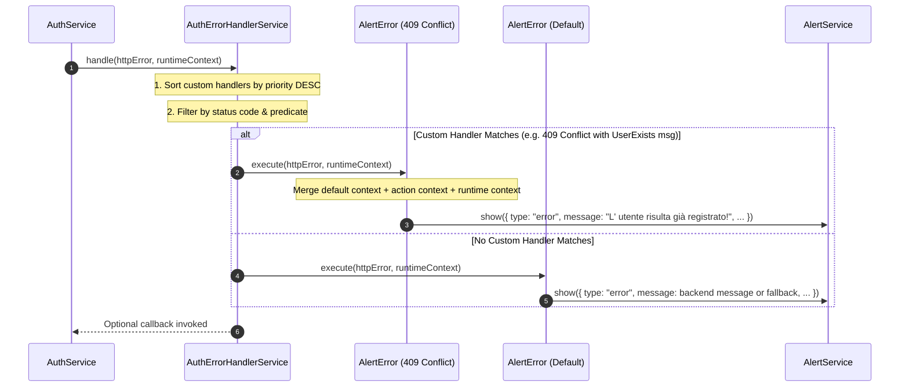

# API Error Handling Architecture

This document describes the architectural design, patterns, and implementation guidelines for HTTP and API error handling in **Il Rusticone Frontend (`rusticone-fe`)**.

---

## 🏛️ Architecture Overview

The error-handling system is built on two complementary design patterns:
1. **Strategy Pattern (`ErrorAction`)**: Encapsulates specific error-handling actions (such as displaying user alerts, modal dialogs, or triggering navigation) into modular, reusable strategies.
2. **Chain of Responsibility / Registry Dispatcher (`ApiErrorHandler`)**: Maintains a reactive registry of error actions, filters matching strategies by HTTP status codes and predicates, sorts them by priority, and executes the winning strategy or falls back to a default action.

```
┌────────────────────────────────────────────────────────┐
│               Angular Service (e.g. AuthService)        │
│         HttpClient Call -> catchError(err => ...)      │
└───────────────────────────┬────────────────────────────┘
                            │
                            ▼
┌────────────────────────────────────────────────────────┐
│            Domain Error Handler (e.g. AuthErrorHandler)│
│               extends BaseErrorHandler                 │
│                                                        │
│  customErrorHandlers: [ ConflictAction, AuthAction ]   │
│  defaultErrorHandler: DefaultAlertAction               │
└───────────────────────────┬────────────────────────────┘
                            │
              ┌─────────────┴─────────────┐
              ▼                           ▼
┌───────────────────────────┐   ┌───────────────────────────┐
│     Custom ErrorAction    │   │    Default ErrorAction    │
│  e.g. AlertError (409)    │   │  e.g. AlertError (Fallback│
│  - predicate: matches msg │   │                           │
│  - priority: 10           │   │                           │
│  - context: { message }   │   │                           │
└─────────────┬─────────────┘   └─────────────┬─────────────┘
              │                               │
              └───────────────┬───────────────┘
                              ▼
               ┌─────────────────────────────┐
               │        AlertService         │
               │   Shows contextual banner   │
               └─────────────────────────────┘
```

---

## 🧱 Core Building Blocks

| Class / Interface | Location | Responsibility |
| :--- | :--- | :--- |
| **`ErrorAction<TContext>`** | `models/error-handler.model.ts` | Interface defining an individual error strategy (status codes, priority, predicate, context, execute). |
| **`BaseErrorAction<TContext>`** | `services/error-handlers/base-error.ts` | Abstract base class implementing `ErrorAction` with fluent method chaining (`setErrorActionConfig`, `setContext`). |
| **`AlertError`** | `services/error-handlers/alert-error.ts` | Concrete action that displays notifications using `AlertService`. |
| **`ApiErrorHandler<TContext>`** | `models/error-handler.model.ts` | Interface defining the error registry and dispatch contract. |
| **`BaseErrorHandler<TContext>`** | `services/error-handlers/base-error.ts` | Abstract base class managing reactive signal registries and priority dispatching. |
| **`AuthErrorHandlerService`** | `services/auth-error-handler.service.ts` | Domain-specific singleton service configured with authentication error rules. |

---

## 🔄 Dispatch Flow & Priority Matching

When an error occurs during an HTTP request, the error handler evaluates all registered actions:



### Matching Rules:
1. **Status Code Matching**: `handler.errorStatus.includes(status)` (an empty array `[]` matches any HTTP status).
2. **Endpoint URL Matching**: If `handler.urls` is specified (e.g. `['/auth/register']`), `httpError.url` must contain at least one of the matching endpoint strings. An empty array or `undefined` matches all URLs.
3. **Predicate Evaluation**: If a `predicate` function is defined, it receives `(httpError, context)` and must return `true`.
4. **Priority Ordering**: Handlers are sorted by `priority` descending (`b.priority - a.priority`), ensuring specific rules take precedence over generic rules.
5. **Fallback**: If no custom action matches, `defaultErrorHandler` is executed.

---

## 🎯 Context Merging Strategy

`AlertError` uses a 3-tier hierarchy to determine what message, duration, and styling to display:

```
┌────────────────────────────────────────────────────────┐
│ 1. Base Class Default                                 │
│    type: 'error', closeTime: 5000, message: 'Default'  │
└───────────────────────────┬────────────────────────────┘
                            │ (overridden by)
                            ▼
┌────────────────────────────────────────────────────────┐
│ 2. Pre-configured Action Context                      │
│    setErrorActionConfig({ context: { message: '...' } })│
└───────────────────────────┬────────────────────────────┘
                            │ (overridden by)
                            ▼
┌────────────────────────────────────────────────────────┐
│ 3. Call-site Runtime Context                           │
│    handle(error, { title: 'Custom Runtime Title' })    │
└────────────────────────────────────────────────────────┘
```

### Message Resolution Precedence:
1. Explicitly configured context message (`context.message`).
2. Backend API payload message (`error.error?.message` or string `error.error`).
3. Angular HTTP error string (`error.message`).
4. Default fallback string (`'Si è verificato un errore'`).

---

## 🛠️ Step-by-Step Implementation Guide

### 1. Creating a Domain Error Handler

To create an error handler for a new domain (e.g. `BuffetErrorHandlerService`):

```typescript
import { HttpErrorResponse, HttpStatusCode } from '@angular/common/http';
import { inject, Service } from '@angular/core';
import { ALERT_DURATION, AlertItem } from '../models/alert.model';
import { AlertService } from './alert.service';
import { AlertError, BaseErrorHandler } from './error-handlers';

@Service()
export class BuffetErrorHandlerService extends BaseErrorHandler<Partial<AlertItem>> {
  #alertService = inject(AlertService);

  // 1. Default fallback alert
  defaultAlert = new AlertError(this.#alertService);

  // 2. Custom action: Buffet package unavailable (404 Not Found)
  packageNotFound = new AlertError(this.#alertService).setErrorActionConfig({
    errorStatus: [HttpStatusCode.NotFound],
    priority: 10,
    description: 'Triggered when a selected buffet package is no longer available',
    context: {
      message: 'Il pacchetto buffet selezionato non è più disponibile.',
      type: 'warning',
      closeTime: ALERT_DURATION.LONG,
    },
  });

  // 3. Custom action: Capacity exceeded (422 Unprocessable Entity)
  capacityExceeded = new AlertError(this.#alertService).setErrorActionConfig({
    errorStatus: [HttpStatusCode.UnprocessableEntity],
    predicate: (err: HttpErrorResponse) =>
      err.error?.code === 'BUFFET_CAPACITY_EXCEEDED',
    priority: 20,
    context: {
      title: 'Capienza superata',
      message: 'Il numero di ospiti supera la capienza massima per la data selezionata.',
      type: 'error',
    },
  });

  constructor() {
    super();
    this.setDefaultHandler(this.defaultAlert);
    this.addCustomHandler(this.packageNotFound);
    this.addCustomHandler(this.capacityExceeded);
  }
}
```

---

### 2. Hooking into an Angular Service

Inject the domain error handler in your service and pipe `catchError`:

```typescript
import { HttpClient, HttpErrorResponse } from '@angular/common/http';
import { inject, Service } from '@angular/core';
import { catchError, Observable, throwError } from 'rxjs';
import { BuffetErrorHandlerService } from './buffet-error-handler.service';

@Service()
export class BuffetService {
  #http = inject(HttpClient);
  #errorHandler = inject(BuffetErrorHandlerService);

  createBooking(payload: BookingRequest): Observable<BookingResponse> {
    return this.#http.post<BookingResponse>('/api/buffet/bookings', payload).pipe(
      catchError((err: HttpErrorResponse) => {
        // Dispatch to error handling subsystem
        this.#errorHandler.handle(err);
        
        // Re-throw so caller/component knows request failed
        return throwError(() => err);
      }),
    );
  }
}
```

---

### 3. Creating a Custom `ErrorAction` Strategy

You are not limited to `AlertError`. You can create any custom strategy by extending `BaseErrorAction`:

```typescript
import { HttpErrorResponse, HttpStatusCode } from '@angular/common/http';
import { Router } from '@angular/router';
import { BaseErrorAction } from './base-error';

export interface RedirectContext {
  route: string[];
}

export class RedirectErrorAction extends BaseErrorAction<RedirectContext> {
  #router: Router;

  constructor(router: Router, defaultRoute: string[] = ['/login']) {
    super();
    this.#router = router;
    this.errorStatus = [HttpStatusCode.Unauthorized];
    this.context = { route: defaultRoute };
  }

  override execute(error: HttpErrorResponse, context = this.context): void {
    const targetRoute = context?.route || ['/login'];
    this.#router.navigate(targetRoute).catch(() => {});
  }
}
```

---

## 📌 Best Practices & Gotchas

1. **Always re-throw errors in `catchError`**:
   Return `throwError(() => err)` inside service `catchError` blocks. Never return `[]` or `of(null)` unless deliberately suppressing errors, otherwise callers and UI loaders will assume the request succeeded.

2. **Check `error.error?.message` for Backend Payloads**:
   In Angular `HttpErrorResponse`, `error.message` contains Angular's internal HTTP string (e.g. `Http failure response for...`). The actual backend JSON payload is located in `error.error?.message`.

3. **Keep Singleton Services Stateless**:
   Avoid storing mutable runtime state on `@Service()` singleton classes. Always pass runtime context as an argument into `handle(httpError, runtimeContext)`.

4. **Use Fluent Chaining**:
   `BaseErrorAction.setErrorActionConfig(...)` and `setContext(...)` return `this`, allowing clean, inline instantiation and configuration.
